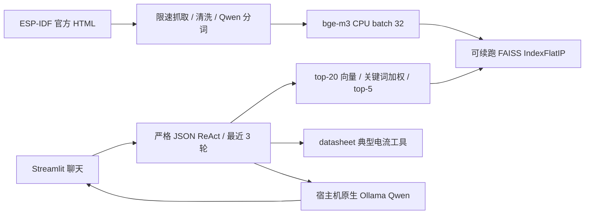
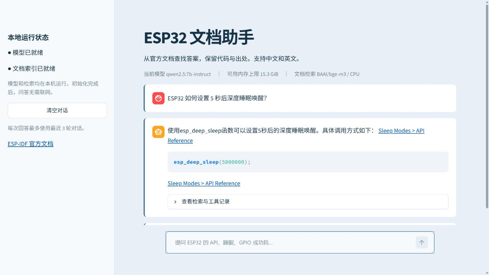
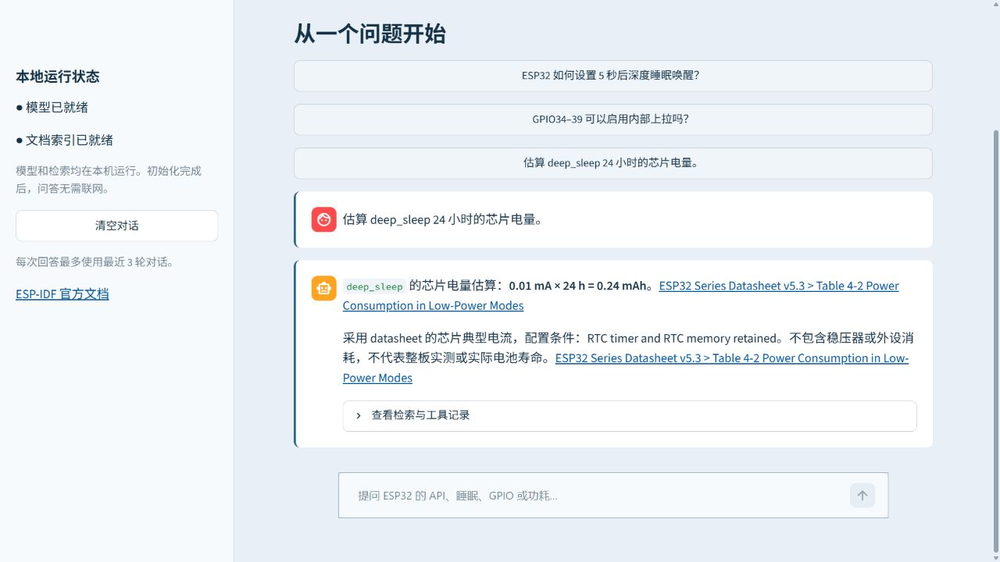

# ESP32 本地文档问答助手

检索 ESP-IDF 官方文档，用中英文回答 ESP32 开发问题并附原章节引用；Qwen 和 bge-m3 全部在本机运行，无云推理 API 或费用。

## 架构



首次准备需要下载公开模型、依赖、官方文档和 Docker 基础镜像。缓存完成后，问答只访问本机 Ollama；检索、分词、模型权重均直接读取本地文件，遥测关闭。官方引用链接由用户点击后才打开网页。

## 硬件要求

| 内存 | 对话模型 | 行为 |
|---|---|---|
| ≥16 GiB | `qwen2.5:7b-instruct` | 自动推荐；有 NVIDIA / Apple Silicon GPU 可加速 |
| 8–16 GiB，不含 16 | `qwen2.5:3b-instruct` | 自动降级，仍使用同一验收标准 |
| <8 GiB | 不支持 | 初始化停止，不安装或拉取模型 |

Embedding 固定 CPU 推理，默认 `BAAI/bge-m3`。纯英文极弱机器可显式改用指定 MiniLM；中文问答请使用 bge-m3。

初始化至少检查 15 GiB 空间，完整环境建议预留 25 GiB；Docker 镜像另计。Qwen 7B 约 4.7 GB，bge-m3 权重约 2.3 GB；Windows 无 symlink 权限时可能缓存两种权重，本机 embedding 目录实测 4.25 GiB。完整官方语料的 CPU 索引构建需要数十分钟，每 32 块写断点，重跑会复用校验通过的批次。

## 原生运行

要求 Python 3.11+、Git Bash（Windows）或 Bash（Linux/macOS）、[原生 Ollama](https://ollama.com/download)。在仓库根目录操作。

1. 启动 Ollama，禁用云功能。Windows 可用项目脚本，它同时把模型存到忽略提交的 `data/models/ollama`：

```powershell
# 单独终端。便携安装可先设置 IOT_OLLAMA_EXE 为 ollama.exe 的绝对路径。
powershell -ExecutionPolicy Bypass -File .\start_ollama.ps1
```

Linux/macOS：

```bash
OLLAMA_NO_CLOUD=1 OLLAMA_MODELS="$PWD/data/models/ollama" ollama serve
```

若 Ollama 桌面服务已占用 11434，先退出它，再启动指定服务。

2. 初始化环境。脚本会检查 Python/pip、内存、空间、原生 Ollama 命令与服务，安装 CPU 依赖，拉取合适的 Qwen，缓存 embedding 和分词器，最后验证离线加载：

```bash
bash setup.sh
# 已初始化后的只读检查，不安装或下载：
bash setup.sh --check
```

Windows 无 Bash 时可用 `python -m src.bootstrap`，检查用 `python -m src.bootstrap --check`。`setup.sh` 支持 `PYTHON` 指定解释器，避免 Windows Store 的空占位命令。

3. 抓取并构建本地索引。Windows 将下方 `.venv/bin/python` 替换为 `.venv\Scripts\python.exe`。PowerShell 中可写 `& .venv\Scripts\python.exe -m ...`：

```bash
.venv/bin/python -m src.ingest.crawl
.venv/bin/python -m src.ingest.clean
.venv/bin/python -m src.ingest.chunk
.venv/bin/python -m src.rag.index
```

抓取范围为 ESP32 API Reference 与 API Guides，遵守 robots、1 req/s、失败重试 3 次。`data/crawl_manifest.json` 保存 URL、UTC 时间、字节数、SHA256 和链接；重新运行不重复下载完整文件。迁移占位页转入真实目标页，清洗时不把迁移通知当证据。

4. 启动聊天界面：

```bash
.venv/bin/python -m streamlit run src/app.py
```

打开 [本地应用](http://localhost:8501)。首屏显示模型、应用可用内存上限、CPU 检索和服务状态。回答带原章节链接，折叠区显示检索与工具操作；清空按钮同时删除 UI 对话和 Agent 历史。

## Docker 运行

容器只包含 App，**Ollama 原生运行在 Docker 宿主机**。先在宿主机初始化模型和 `data/`，然后：

```bash
docker compose up --build -d
docker compose ps
```

打开 [localhost:8501](http://localhost:8501)。Compose 将地址覆盖为 `http://host.docker.internal:11434`，并包含 Linux 必须的 `extra_hosts: ["host.docker.internal:host-gateway"]`。数据目录只读挂载，不把权重打进镜像。网页端口只监听本机回环。

Linux Docker Engine 的 host-gateway 通常是 `docker0` 地址。只监听 `127.0.0.1` 的 Ollama 无法接受网桥访问；请先查看 `ip -4 address show docker0`，将原生服务的 `OLLAMA_HOST` 设置为该网桥 IP 的 `:11434`，再启动服务。不要把示例网桥 IP 当成所有机器的固定值。

本次 Windows 验证使用免费 WSL Ubuntu 24.04 + Docker Engine，原生 Linux Ollama 在同一 WSL 宿主机运行并复用已有模型文件，监听本地 Docker 网桥。Windows 原生运行与 WSL 容器运行分别使用各自宿主机的 Ollama。本机容器可用内存上限实测 15.3 GiB，Compose 显式指定已准备的 7B，GPU 推理已实际验证。

WSL 的 systemd 服务本身不会阻止发行版空闲退出。本次本地交付的外层 `启动助手.ps1` 保持 WSL 活跃、启动项目服务和 Compose，`停止助手.ps1` 停止对应应用。它们位于本机仓库目录的上一层，依赖本次配置好的 Ubuntu；其他机器按上述通用运行步骤初始化。

## 配置

全部设置集中在 `src/config.py`，环境变量覆盖：

| 变量 | 默认 | 说明 |
|---|---|---|
| `IOT_CHAT_MODEL` | 按内存选 7B/3B | 只允许指定的两个本地 Qwen 模型 |
| `IOT_EMBED_MODEL` | `BAAI/bge-m3` | 指定 MiniLM 仅适合英文 |
| `IOT_OLLAMA_URL` | `http://localhost:11434` | 只允许回环地址或 `host.docker.internal`，拒绝云主机 |
| `IOT_DATA_DIR` | `data` | 相对路径以仓库根目录为基准 |
| `IOT_NUM_CTX` | `8192` | 上下文上限；会先删除最旧完整历史，再减少检索块 |
| `IOT_KEEP_ALIVE` | `30m` | 模型驻留时间 |
| `IOT_TOP_K` | `5` | 可改为 1–5，减少输入时建议 3 |
| `IOT_CRAWL_MAX_PAGES` | `0` | 0 表示全量；正数用于小样本验证 |
| `IOT_EMBED_THREADS` | `8` | 不超过 CPU 逻辑核心数；本机 24 核实测 24 线程更快 |

系统 prompt ≤800 Qwen tokens；每块 200–400 tokens；检索 top-20 后按 API/寄存器及中英文关键词加权，取 top-5。历史仅保留最近 3 轮，每次请求实际计算 chat template 的 token 数，预留输出预算。

ReAct 使用严格 JSON，拒绝多余键、重复键、NaN、错误参数；失败只修复一次，再跳过工具直接回答或诚实拒答。最多 4 次工具操作（包括首轮检索）。Ollama `/api/chat` 是唯一生成入口，超时 120 秒、重试 2 次。资料内的指令视为数据，不执行。函数名使用完整标识符加权；回答中的 API 调用需在检索文本存在，显式 C 声明还会核对签名。

功耗工具计算 `mAh = 典型 mA × 小时`，引用 ESP32 Series Datasheet v5.3 Table 4-2 或 Table 5-4。`deep_sleep` 明确指 RTC timer + RTC memory 保留的 10 µA 配置；Wi-Fi TX 配置包含原表的 50% 占空条件，不再次折半。估算只针对芯片，排除稳压器、外设，不能作为整板实测或电池寿命承诺。

## 验证与评测

固定 30 题，中英文各 15；包含期望原章节、关键事实及两个不存在 API 的拒答题。

```bash
.venv/bin/python -m unittest discover -s tests -v
.venv/bin/python -m src.eval.run_eval --mode rag --limit 10
.venv/bin/python -m src.eval.run_eval
# 中断后复用同配置、同语料、同实现的已完成问题：
.venv/bin/python -m src.eval.run_eval --resume
```

终端与 `eval/report.txt` 输出引用章节命中率、拒答率、平均响应时长、生成 tok/s、实际 JSON 合规率。`eval/results.json` 保留原回答、实际工具参数与引用，供人工逐题复核。自动关键词检查只作为筛查，人工验收需核对事实和来源；未知 API 的拒答不计入可回答题的引用分母。

2026-10-08 本机实测：Windows、Python 3.11.9、31.43 GiB 内存、Core Ultra 9 275HX、RTX 5060 Laptop GPU 8 GiB、Ollama 0.40.1、Qwen 7B Q4_K_M、bge-m3 CPU、Torch 2.14.1+cpu。

| 检查 | 实测 |
|---|---|
| Phase 0 | `bash setup.sh` 与 `--check` 均通过，依赖检查、模型下载、离线加载通过 |
| Phase 1 | 281 页，失败 0；1,630 章节；5,912 块，200–393 tokens；随机 5 个锚点全部有效 |
| Phase 2 | 完整 IndexFlatIP 5,912 × 1,024；中断续跑 / 损坏批次检查通过；直接 RAG 前 10 题引用章节命中 8/10 |
| Phase 3 | 实际三轮上下文正确；两次功耗参数正确，分别 0.24 / 8 mAh；7/7 ReAct JSON；系统 prompt 501 tokens；socket 记录仅回环 |
| Phase 4 | Docker healthy、localhost:8501 可用、宿主机原生 Ollama 100% GPU / context 8192；真实 UI 三轮与清空 / 功耗工具验证；45 项测试通过 |
| 30 题人工验收 | **24/30，80%**；包括两道正确拒答题；逐题事实 / 来源复核另见下方记录 |
| 30 题自动检查 | 21/30；预期引用章节命中 24/28（85.7%）；越界链接 0；拒答 4/30（13.3%） |
| 原生性能 | 完整评测平均 2.99 s；实际生成 **57.23 tok/s**（Ollama token / eval_duration，非估计） |
| JSON / 降级 | 40/40 合法 ReAct JSON；5 次格式 / 证据校验降级，合法 JSON 不等于事实准确 |
| WSL 容器性能 | 首次 `/api/chat` 含模型加载实测 50.98 s；首个回答生成 33.06 tok/s；此前还需首次加载 CPU embedding。不可套用原生平均延迟 |

[Phase 1 原始章节抽样记录](docs/phase1-validation.md)、[Phase 2–3 原始验证](docs/phase2-3-validation.md)、[30 题人工复核及全部失败题](docs/evaluation-validation.md)。

人工未通过的是第 2、15、16、17、18、28 题：引用小节不贴切、数值未答完整、不必要拒答、任务与用户 API 混淆。链接白名单能阻止 URL 编造，不能保证所有事实或来源选择正确；本次只达到规定门槛，使用 API 前仍应查看附带的官方原章节。

## 问答截图

以下为本机实际运行截图，回答与工具记录来自真实本地模型：

深度睡眠调用及官方引用：



三轮追问和检索记录：


芯片电量估算及 datasheet 引用：



## 故障排查

| 现象 | 原因与修复 |
|---|---|
| `ollama: command not found` | 未安装或 PATH 未更新；从官方安装、重开终端、重跑 setup |
| localhost:11434 连接失败 | 先运行 `ollama serve`；检查地址与端口占用 |
| 容器连不上模型 | 检查 `extra_hosts`；Linux 原生 Ollama 必须监听对应本地网桥 |
| OOM / 进程被杀 | 关闭其他大程序，显式使用指定 3B 模型；少于 8 GiB 停止 |
| 回答慢 | 确认 `ollama ps` 的 GPU 状态；减小上下文或 top-k，CPU 生成会较慢 |
| Apple Silicon 无 faiss wheel | 使用支持的 Python 版本；官方 FAISS conda 安装说明见下方链接。不要未经验证换成外部向量服务 |
| 中文检索跑偏 | 确认使用 bge-m3，英文 MiniLM 不支持此验收目标 |
| 非 JSON 输出 | 检查上下文预算，设 `IOT_TOP_K=3`；已有单次修复和安全降级 |
| embedding 首次很慢 | 首次下载权重或 CPU 构建中；看终端批次进度，重跑可续建 |
| 离线缓存不完整 | 联网重跑 setup，完成离线检查后再断网运行 |
| 索引不存在 | 按顺序执行 crawl、clean、chunk、index；不要只创建空目录 |

`data/`、`.venv`、`.env`、模型权重和生成评测文件均不提交；源规范 `AGENTS.md` 保持原文。

## 官方参考

- [Ollama 本地服务、禁用云功能](https://docs.ollama.com/faq)
- [Ollama Chat API](https://docs.ollama.com/api/chat)
- [SentenceTransformer 本地模型参数](https://www.sbert.net/docs/package_reference/sentence_transformer/model.html)
- [FAISS 安装](https://github.com/facebookresearch/faiss/blob/main/INSTALL.md)
- [ESP-IDF ESP32 官方文档](https://docs.espressif.com/projects/esp-idf/en/latest/esp32/)
- [ESP32 Datasheet](https://www.espressif.com/sites/default/files/documentation/esp32_datasheet_en.pdf)
